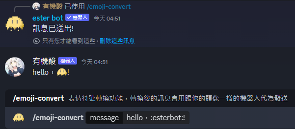

# /auto-reply 自動回應

## 自動回應是什麼

自動回應就是：假設你設定了對「蘋果」會回應「西瓜」的話，那麼只要有人輸入「蘋果」，acid bot就會傳送一則訊息寫著「西瓜」。

例如下圖，預先設定了對「晚安」會回應文字：

可以當作是一種朋友，也可以做為發言提醒，或者成為謎題的一部份也可以。有了這個功能，也能為群組的討論增添色彩。

## 一般用戶可以使用的功能

### /auto-reply show

顯示目前有設定的文字。下面的按鈕可以切換其他的頁面。

## 只有管理員才能使用的功能

### /auto-reply add

新增一個自動回應。

#### 必填項：

* trigger-message:要偵測的訊息。
* reply-message:要回應的訊息。
* mode:設定要偵測的模式。

| mode名稱 | mode的含意                        |
| ------ | ------------------------------ |
| 完全相符   | 輸入的文字需要與設定的文字相符，acid bot才會回應。  |
| 部分相符   | 只要輸入的文字中有包含設定的文字，acid bot就會回應。 |

### /auto-reply remove

刪除已經設定的自動回應。

#### 必填項：

* auto-reply-id:自動回應的ID。會在設定成功時顯示，也可以藉由/auto-reply show查詢。

### /auto-reply reset

​清除所有已設定的自動回應。


此操作無法復原，請仔細考慮。


