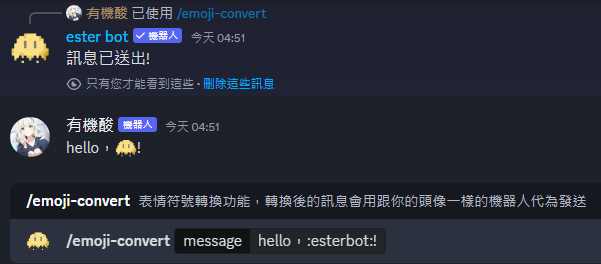

# /emoji-convert 表情符號轉換

## 指令一覽

### /emoji-convert

進行表情符號的轉緩，轉換後的訊息會用跟你的頭像一樣的機器人代為發送。\
功能和用法與[表情符號轉換功能](../basic-illustrate.md#biao-qing-fu-hao-zhuan-huan-gong-neng)相同。

#### 填入選項

* message: 要轉換的訊息，在這裡輸入的:emoji:都會轉換成真正的表情符號！(可以用\n換行)

<figure><figcaption>
在訊息區輸入內容並發送，可以看到機器人用跟你幾乎一模一樣的機器人傳送轉換表情符號後的訊息
</figcaption></figure>
